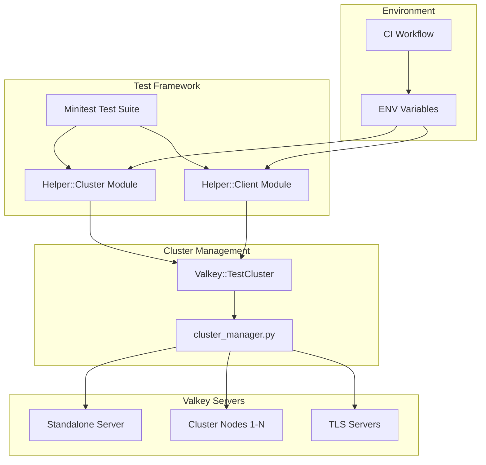
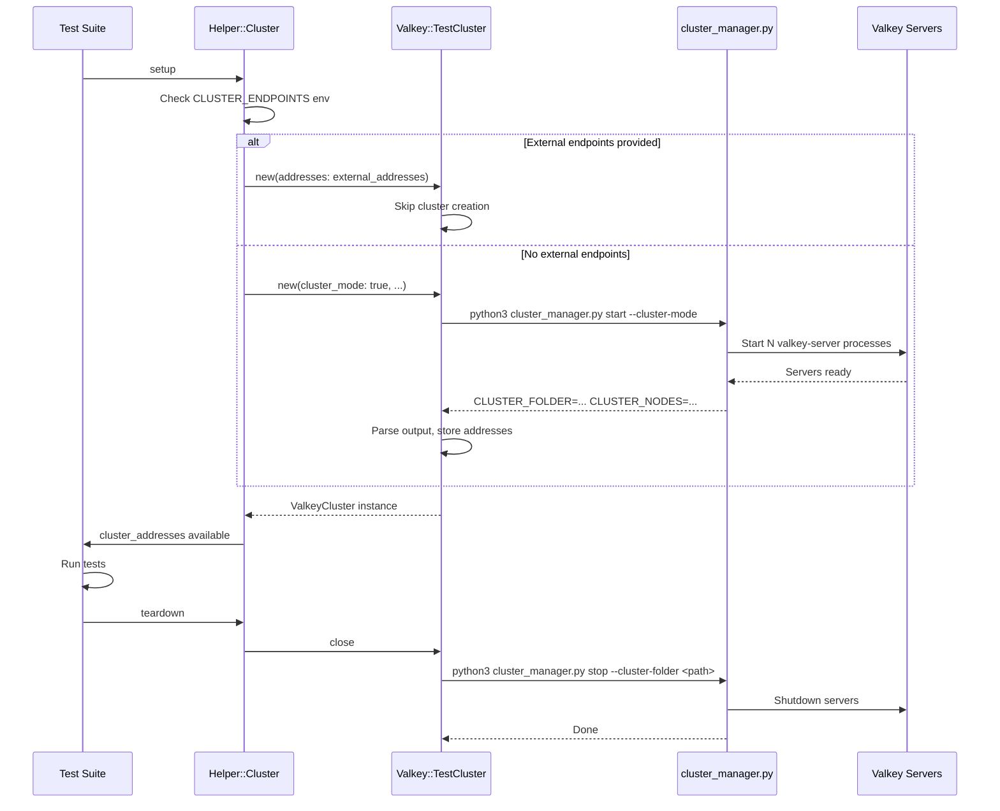

# Technical Design Document

## Overview

This document describes the technical design for aligning the valkey-glide-ruby client's cluster testing infrastructure with other GLIDE clients (Python, Java, Go). The core change is replacing the Docker-based cluster solution (`grokzen/redis-cluster:7.0.15`) with programmatic control of Valkey servers via the shared `cluster_manager.py` script located in the `valkey-glide/utils/` submodule.

### Goals

1. **Consistency**: Align with Python, Java, and Go GLIDE clients that already use `cluster_manager.py`
2. **Flexibility**: Enable dynamic port allocation, TLS testing, and module loading without Docker constraints
3. **Native Valkey Support**: Run actual Valkey servers instead of Redis Docker images
4. **Simplified CI**: Remove Docker service dependencies for cluster tests

### Non-Goals

- Changing the Valkey client API or command implementations
- Modifying the `cluster_manager.py` script itself
- Supporting Windows WSL environments (Linux/macOS CI only)

## Architecture

The design introduces a Ruby wrapper class (`ValkeyCluster`) that invokes `cluster_manager.py` via subprocess, following the same pattern established by the Python `ValkeyCluster` class. The wrapper integrates with the existing test helper modules to provide transparent cluster management.



### Component Interaction Flow



## Components and Interfaces

### 1. Valkey::TestCluster Class

A new Ruby class in `lib/valkey/test_cluster.rb` that wraps `cluster_manager.py` invocation.

```ruby
module Valkey
  class TestCluster
    # Cluster addresses as array of {host:, port:} hashes
    attr_reader :addresses
    
    # Path to the cluster folder (for cleanup)
    attr_reader :cluster_folder
    
    # TLS certificate paths (when TLS enabled)
    attr_reader :tls_cert_path, :tls_key_path, :tls_ca_cert_path
    
    # @param cluster_mode [Boolean] Enable cluster mode (default: false for standalone)
    # @param tls [Boolean] Enable TLS (default: false)
    # @param shard_count [Integer] Number of shards/primaries (default: 3)
    # @param replica_count [Integer] Replicas per shard (default: 1)
    # @param load_module [Array<String>] Paths to modules to load
    # @param addresses [Array<Hash>] Pre-existing addresses to use (skips cluster creation)
    def initialize(
      cluster_mode: false,
      tls: false,
      shard_count: 3,
      replica_count: 1,
      load_module: nil,
      addresses: nil
    )
    end
    
    # Explicitly stop the cluster and clean up resources
    def close
    end
    
    private
    
    # Resolve path to cluster_manager.py in valkey-glide submodule
    def script_path
    end
    
    # Build command-line arguments for cluster_manager.py
    def build_start_args
    end
    
    # Parse CLUSTER_FOLDER and CLUSTER_NODES from script output
    def parse_output(output)
    end
  end
end
```

### 2. Updated Helper::Cluster Module

Modify `test/support/helper/cluster.rb` to use `Valkey::TestCluster` instead of relying on static `CLUSTER_NODES`.

```ruby
module Helper
  module Cluster
    include Generic
    
    # Class-level cluster instance (shared across all cluster tests)
    @test_cluster = nil
    
    class << self
      attr_accessor :test_cluster
      
      def cluster_addresses
        # Priority: ENV > dynamically created cluster
        if ENV['CLUSTER_ENDPOINTS']
          parse_endpoints(ENV['CLUSTER_ENDPOINTS'])
        elsif test_cluster
          test_cluster.addresses
        else
          start_cluster
          test_cluster.addresses
        end
      end
      
      def start_cluster
        return if test_cluster
        
        @test_cluster = Valkey::TestCluster.new(
          cluster_mode: true,
          tls: ENV['CLUSTER_TLS'] == 'true',
          load_module: parse_module_paths(ENV['CLUSTER_MODULES'])
        )
      end
      
      def stop_cluster
        test_cluster&.close
        @test_cluster = nil
      end
      
      private
      
      def parse_endpoints(endpoints_str)
        # Parse "host1:port1,host2:port2" format
      end
      
      def parse_module_paths(modules_str)
        # Parse comma-separated module paths
      end
    end
    
    # ... existing methods updated to use cluster_addresses
  end
end
```

### 3. Updated Helper::Client Module (Standalone Support)

Modify `test/support/helper/client.rb` to optionally use `Valkey::TestCluster` for standalone servers.

```ruby
module Helper
  module Client
    include Generic
    
    @test_server = nil
    
    class << self
      attr_accessor :test_server
      
      def server_address
        if ENV['STANDALONE_ENDPOINTS']
          parse_endpoint(ENV['STANDALONE_ENDPOINTS'])
        elsif test_server
          test_server.addresses.first
        else
          # Fall back to default localhost:6379 for backward compatibility
          { host: '127.0.0.1', port: PORT }
        end
      end
      
      def start_server
        return if test_server || ENV['STANDALONE_ENDPOINTS']
        
        @test_server = Valkey::TestCluster.new(
          cluster_mode: false,
          tls: ENV['STANDALONE_TLS'] == 'true',
          replica_count: 0,
          load_module: parse_module_paths(ENV['STANDALONE_MODULES'])
        )
      end
      
      def stop_server
        test_server&.close
        @test_server = nil
      end
    end
  end
end
```

### 4. CI Workflow Configuration

Update `.github/workflows/CI.yml` to:
- Install Python 3 and Valkey server
- Remove Docker cluster service
- Set environment variables for cluster configuration
- Upload cluster logs on failure

## Data Models

### Cluster Manager Output Format

The `cluster_manager.py` script outputs key-value pairs that must be parsed:

```
LOG_FILE=/path/to/clusters/cluster-2024-01-15T10-30-00Z-abc123/cluster_manager.log
CLUSTER_FOLDER=/path/to/clusters/cluster-2024-01-15T10-30-00Z-abc123
CLUSTER_NODES=127.0.0.1:12345,127.0.0.1:12346,127.0.0.1:12347,...
SERVERS_JSON=[{"host":"127.0.0.1","port":12345,"pid":1234,"is_primary":true},...]
```

### Parsed Address Structure

```ruby
{
  host: "127.0.0.1",  # String - IP address
  port: 12345         # Integer - TCP port
}
```

### TLS Certificate Paths (from cluster_manager.py defaults)

```ruby
{
  tls_cert_path: "/path/to/valkey-glide/utils/tls_crts/server.crt",
  tls_key_path: "/path/to/valkey-glide/utils/tls_crts/server.key",
  tls_ca_cert_path: "/path/to/valkey-glide/utils/tls_crts/ca.crt"
}
```

## Error Handling

### Script Execution Errors

| Error Condition | Handling |
|-----------------|----------|
| `cluster_manager.py` not found | Raise `Valkey::TestCluster::ScriptNotFoundError` with informative message |
| Python 3 not available | Raise `Valkey::TestCluster::PythonNotFoundError` |
| Script returns non-zero exit | Raise `Valkey::TestCluster::ClusterStartError` with stderr content |
| Output parsing fails | Raise `Valkey::TestCluster::OutputParseError` |
| Valkey server not installed | Let `cluster_manager.py` error propagate (it checks for valkey-server/redis-server) |

### Cleanup Errors

Cleanup errors during `close` are suppressed silently (logged at debug level if logging is enabled) to avoid masking test failures. This matches the Python implementation behavior.

### Path Resolution Errors

| Error Condition | Handling |
|-----------------|----------|
| Submodule not initialized | Raise error with message to run `git submodule update --init` |
| Script path has special characters | Use `Shellwords.escape` for safe subprocess invocation |

## Testing Strategy

### Overview

This feature uses a dual testing approach:
- **Property-based tests**: Verify universal properties across generated inputs using the `rantly` gem
- **Unit tests**: Verify specific examples, edge cases, and error conditions
- **Integration tests**: Verify end-to-end behavior with actual Valkey servers

### Property-Based Testing Configuration

**Library**: `rantly` gem (Ruby property-based testing library)
**Minimum iterations**: 100 per property test
**Tag format**: `Feature: cluster-manager-alignment, Property {number}: {description}`

### Property Test Implementations

#### Property 1: Configuration to Arguments Mapping

```ruby
# test/valkey/test_cluster_test.rb
# Feature: cluster-manager-alignment, Property 1: Configuration to Command-Line Arguments Mapping

def test_property_configuration_to_arguments
  property_of {
    cluster_mode = boolean
    tls = boolean
    shard_count = range(1, 100)
    replica_count = range(0, 10)
    module_count = range(0, 5)
    load_module = module_count.times.map { sized(20) { string(:alnum) } }
    
    [cluster_mode, tls, shard_count, replica_count, load_module]
  }.check(100) { |cluster_mode, tls, shard_count, replica_count, load_module|
    args = Valkey::TestCluster.build_start_args(
      cluster_mode: cluster_mode,
      tls: tls,
      shard_count: shard_count,
      replica_count: replica_count,
      load_module: load_module.empty? ? nil : load_module
    )
    
    assert_equal 'python3', args[0]
    assert args[1].end_with?('cluster_manager.py')
    
    assert_equal tls, args.include?('--tls')
    assert args.include?('start')
    assert_equal cluster_mode, args.include?('--cluster-mode')
    
    n_index = args.index('-n')
    assert n_index
    assert_equal shard_count.to_s, args[n_index + 1]
    
    r_index = args.index('-r')
    assert r_index
    assert_equal replica_count.to_s, args[r_index + 1]
    
    load_module.each do |mod_path|
      mod_indices = args.each_index.select { |i| args[i] == '--load-module' }
      assert mod_indices.any? { |i| args[i + 1] == mod_path }
    end
  }
end
```

#### Property 2: Output Parsing

```ruby
# Feature: cluster-manager-alignment, Property 2: Cluster Manager Output Parsing

def test_property_output_parsing
  property_of {
    folder_path = "/tmp/clusters/#{sized(20) { string(:alnum) }}"
    node_count = range(1, 20)
    nodes = node_count.times.map do
      host = choose('127.0.0.1', 'localhost', '::1')
      port = range(1024, 65535)
      { host: host, port: port }
    end
    
    [folder_path, nodes]
  }.check(100) { |folder_path, nodes|
    nodes_str = nodes.map { |n| "#{n[:host]}:#{n[:port]}" }.join(',')
    output = <<~OUTPUT
      LOG_FILE=#{folder_path}/cluster_manager.log
      CLUSTER_FOLDER=#{folder_path}
      CLUSTER_NODES=#{nodes_str}
    OUTPUT
    
    result = Valkey::TestCluster.parse_output(output)
    
    assert_equal folder_path, result[:cluster_folder]
    assert_equal nodes.length, result[:addresses].length
    
    nodes.each_with_index do |expected, i|
      assert_equal expected[:host], result[:addresses][i][:host]
      assert_equal expected[:port], result[:addresses][i][:port]
    end
  }
end
```

#### Property 3: Endpoint String Parsing

```ruby
# Feature: cluster-manager-alignment, Property 3: Endpoint String Parsing

def test_property_endpoint_parsing_roundtrip
  property_of {
    node_count = range(1, 20)
    nodes = node_count.times.map do
      host_parts = range(1, 4).times.map { range(0, 255) }
      host = host_parts.join('.')
      port = range(1, 65535)
      { host: host, port: port }
    end
    nodes
  }.check(100) { |nodes|
    endpoint_str = nodes.map { |n| "#{n[:host]}:#{n[:port]}" }.join(',')
    
    parsed = Helper::Cluster.parse_endpoints(endpoint_str)
    
    assert_equal nodes.length, parsed.length
    nodes.each_with_index do |expected, i|
      assert_equal expected[:host], parsed[i][:host]
      assert_equal expected[:port], parsed[i][:port]
    end
    
    # Round-trip property
    formatted = parsed.map { |n| "#{n[:host]}:#{n[:port]}" }.join(',')
    assert_equal endpoint_str, formatted
  }
end
```

#### Property 4: Safe Path Handling

```ruby
# Feature: cluster-manager-alignment, Property 4: Safe Path Handling in Subprocess Commands

def test_property_safe_path_handling
  property_of {
    # Generate paths with potentially dangerous characters
    base = sized(10) { string(:alnum) }
    special_chars = choose(' ', "'", '"', '$', '`', '!', '*', '?', 
                          '[', ']', '{', '}', '(', ')', '|', '&', 
                          ';', '<', '>', '\\', "\n", 'ü', '中')
    path = "/tmp/#{base}#{special_chars}#{base}"
    path
  }.check(100) { |path|
    # Verify that the command array properly isolates the path
    cmd = Valkey::TestCluster.build_stop_command(path, tls: false)
    
    # When using array form with Open3.capture3, each element is a separate argument
    # The path should be a single element, not split or interpreted
    folder_index = cmd.index('--cluster-folder')
    assert folder_index
    assert_equal path, cmd[folder_index + 1]
    
    # Verify no shell metacharacter expansion would occur
    # (Array form bypasses shell interpretation)
    assert cmd.is_a?(Array)
    assert cmd.all? { |arg| arg.is_a?(String) }
  }
end
```

### Unit Tests

Unit tests focus on specific scenarios and edge cases:

| Test Case | Description |
|-----------|-------------|
| `test_initialize_with_addresses` | Skip cluster creation when addresses provided |
| `test_script_not_found_error` | Raise informative error when script missing |
| `test_python_not_found_error` | Raise error when Python 3 unavailable |
| `test_non_zero_exit_code` | Raise exception with stderr on script failure |
| `test_malformed_output` | Handle output missing required fields |
| `test_tls_certificate_paths` | Expose TLS paths when TLS enabled |
| `test_default_values` | Verify default shard_count=3, replica_count=1 |
| `test_env_var_priority` | ENV endpoints override dynamic creation |

### Integration Tests

Integration tests verify end-to-end behavior with actual Valkey servers:

| Test Case | Description |
|-----------|-------------|
| `test_standalone_start_stop` | Start standalone server, verify ping, stop |
| `test_cluster_start_stop` | Start 3-shard cluster, verify CLUSTER NODES, stop |
| `test_tls_cluster` | Start TLS cluster, verify secure connection |
| `test_module_loading` | Start with JSON module, verify MODULE LIST |
| `test_cleanup_on_gc` | Verify finalizer cleans up orphaned clusters |
| `test_concurrent_clusters` | Multiple test clusters can coexist |

### Test File Locations

- `test/valkey/test_cluster_test.rb` - Property and unit tests for `Valkey::TestCluster`
- `test/cluster/cluster_commands_test.rb` - Existing cluster integration tests (use new infrastructure)
- `test/valkey/*_test.rb` - Existing standalone tests (optionally use new infrastructure)

## Implementation Notes

### Subprocess Invocation

Use Ruby's `Open3.capture3` for subprocess execution:

```ruby
require 'open3'
require 'shellwords'

def start_cluster
  cmd = build_command
  stdout, stderr, status = Open3.capture3(*cmd)
  
  unless status.success?
    raise ClusterStartError, "cluster_manager.py failed: #{stderr}"
  end
  
  parse_output(stdout)
end

def build_command
  [
    'python3',
    script_path,
    *(@tls ? ['--tls'] : []),
    'start',
    *(@cluster_mode ? ['--cluster-mode'] : []),
    '-n', @shard_count.to_s,
    '-r', @replica_count.to_s,
    *@load_module&.flat_map { |m| ['--load-module', m] }
  ]
end
```

### Finalizer for Cleanup

Register a finalizer to ensure cleanup even if `close` is not called:

```ruby
def initialize(...)
  # ... setup code ...
  
  ObjectSpace.define_finalizer(self, self.class.cleanup_proc(@cluster_folder, @tls))
end

def self.cleanup_proc(cluster_folder, tls)
  proc do
    return unless cluster_folder
    cmd = ['python3', script_path]
    cmd << '--tls' if tls
    cmd += ['stop', '--cluster-folder', cluster_folder]
    system(*cmd, out: File::NULL, err: File::NULL)
  end
end

def close
  return unless @cluster_folder
  
  # Remove finalizer since we're cleaning up manually
  ObjectSpace.undefine_finalizer(self)
  
  # Run cleanup
  cmd = ['python3', script_path]
  cmd << '--tls' if @tls
  cmd += ['stop', '--cluster-folder', @cluster_folder]
  
  # Suppress errors during cleanup
  system(*cmd, out: File::NULL, err: File::NULL)
  
  @cluster_folder = nil
  @addresses = nil
end
```

### CI Workflow Updates

Key changes to `.github/workflows/CI.yml`:

```yaml
cluster:
  needs: [build-native-library]
  runs-on: ubuntu-latest
  name: Cluster / Ruby ${{ matrix.ruby }}
  
  steps:
    - uses: actions/checkout@v4
      with:
        submodules: recursive
    
    - name: Set up Python
      uses: actions/setup-python@v5
      with:
        python-version: '3.11'
    
    - name: Install Valkey
      run: |
        curl -fsSL https://packages.valkey.io/gpg | sudo gpg --dearmor -o /usr/share/keyrings/valkey-archive-keyring.gpg
        echo "deb [signed-by=/usr/share/keyrings/valkey-archive-keyring.gpg] https://packages.valkey.io/deb $(lsb_release -cs) main" | sudo tee /etc/apt/sources.list.d/valkey.list
        sudo apt-get update
        sudo apt-get install -y valkey
    
    # No Docker service needed - cluster_manager.py starts Valkey processes directly
    
    - name: Run cluster tests
      run: bundle exec rake test:cluster
    
    - name: Upload cluster logs on failure
      if: failure()
      uses: actions/upload-artifact@v4
      with:
        name: cluster-logs-${{ matrix.ruby }}
        path: valkey-glide/utils/clusters/
        retention-days: 7
```

### Backward Compatibility

The design maintains backward compatibility:

1. **Environment variables**: `CLUSTER_ENDPOINTS` and `STANDALONE_ENDPOINTS` allow external cluster specification
2. **Default behavior**: If no env vars are set and `cluster_manager.py` fails, tests fall back to expecting servers on default ports
3. **Test helper API**: The `_new_client` methods continue to work unchanged
4. **CLUSTER_NODES constant**: Deprecated but still available for tests that reference it directly

### Reference Implementation Alignment

| Feature | Python | Java | Go | Ruby (this design) |
|---------|--------|------|-----|-------------------|
| Wrapper class | `ValkeyCluster` | Gradle tasks | `runClusterManager()` | `Valkey::TestCluster` |
| Output parsing | `parse_cluster_script_start_output` | `extractAddressesFromClusterManagerOutput` | `extractAddresses` | `parse_output` |
| Cleanup | `__del__` | `stopAllAfterTests` | `TearDownSuite` | `close` + finalizer |
| TLS support | `--tls` flag | `--tls` flag | `--tls` flag | `tls:` parameter |
| Module loading | `--load-module` | N/A in build.gradle | N/A | `load_module:` parameter |
| External endpoints | Constructor parameter | System properties | Command-line flags | Environment variables |

## Correctness Properties

*A property is a characteristic or behavior that should hold true across all valid executions of a system—essentially, a formal statement about what the system should do. Properties serve as the bridge between human-readable specifications and machine-verifiable correctness guarantees.*

### Property 1: Configuration to Command-Line Arguments Mapping

*For any* valid `ValkeyCluster` configuration (any combination of `cluster_mode`, `tls`, `shard_count` in range 1-100, `replica_count` in range 0-10, and `load_module` with 0-5 module paths), the generated command-line arguments array SHALL:
- Contain `'python3'` as the first element
- Contain the script path as the second element
- Include `'--tls'` if and only if `tls` is true
- Include `'start'` as a subcommand
- Include `'--cluster-mode'` if and only if `cluster_mode` is true
- Include `'-n'` followed by the string representation of `shard_count`
- Include `'-r'` followed by the string representation of `replica_count`
- Include `'--load-module'` followed by each module path, in order, for each module in `load_module`

**Validates: Requirements 1.1, 1.5, 1.6, 1.7, 1.8, 1.9, 4.1, 5.1, 5.3, 6.1, 6.2**

### Property 2: Cluster Manager Output Parsing

*For any* valid `cluster_manager.py` output string containing:
- A line matching `CLUSTER_FOLDER=<path>` where `<path>` is any non-empty string without newlines
- A line matching `CLUSTER_NODES=<nodes>` where `<nodes>` is a comma-separated list of 1-20 `host:port` pairs

The `parse_output` method SHALL return a result where:
- `cluster_folder` equals the extracted `<path>` value
- `addresses` is an array of hashes, each with `:host` (String) and `:port` (Integer) keys
- The addresses array has the same length as the number of comma-separated pairs in `<nodes>`
- Each address's host and port match the corresponding parsed pair

**Validates: Requirements 1.2**

### Property 3: Endpoint String Parsing

*For any* valid endpoint string in the format `"host1:port1,host2:port2,..."` where:
- Each host is a non-empty string matching `[a-zA-Z0-9\.\-]+` (alphanumeric, dots, hyphens)
- Each port is an integer in range 1-65535
- There are 1-20 endpoint pairs

The endpoint parsing function SHALL produce an array of hashes where:
- The array length equals the number of comma-separated pairs
- Each hash has `:host` (String) and `:port` (Integer) keys
- Each host and port correctly correspond to the input pair
- Parsing is the inverse of formatting: `format(parse(s)) == s` for any valid string `s`

**Validates: Requirements 2.2, 5.5**

### Property 4: Safe Path Handling in Subprocess Commands

*For any* string used as a file path parameter (cluster_folder, module paths, script path), including strings containing:
- Spaces
- Single quotes, double quotes
- Shell metacharacters (`$`, `` ` ``, `!`, `*`, `?`, `[`, `]`, `{`, `}`, `(`, `)`, `|`, `&`, `;`, `<`, `>`, `\`, newlines)
- Unicode characters

The subprocess command construction SHALL produce a command that, when executed, treats the entire path as a single argument without shell interpretation or injection.

**Validates: Requirements 7.3**
